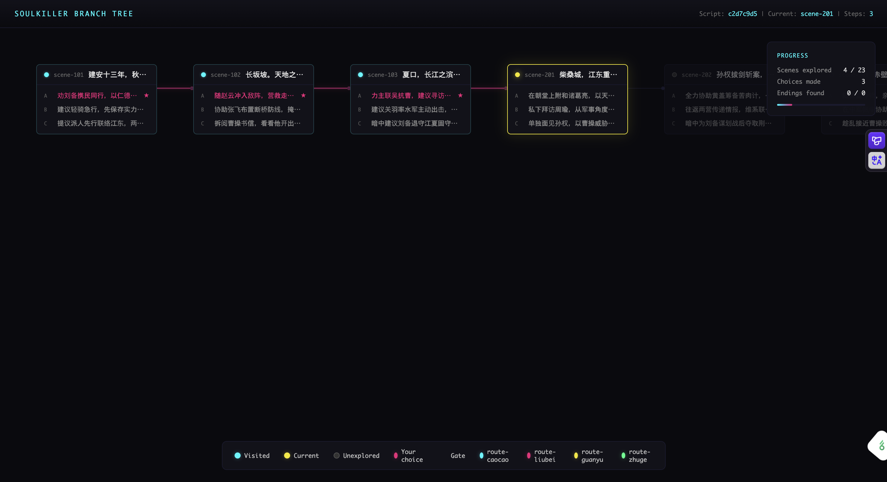

<h1 align="center">SOULKILLER</h1>

<p align="center">
  コマンド一つで、任意の人物のデジタル痕跡からプレイ可能なテキストアドベンチャーを生成する。
</p>

<p align="center">
  <a href="./README.md">中文</a> · <a href="./README.en.md">English</a> · <strong>日本語</strong>
</p>

---

> **各事業部技術担当者へ：**
>
> SOULKILLER プロトコルの中核任務：公開データから対象人物の「魂」——アイデンティティ、言語スタイル、行動パターン——を抽出し、AI キャラクターへ蒸留した上で、配布可能なインタラクティブ・テキストアドベンチャー（ビジュアルノベル）を自動生成する。操作者にコーディングは一切不要である。
>
> 名前を入力してキャラクターを生成し、世界観を入力して世界を構築し、両者を統合すれば——完成されたギャルゲーの脚本が出力される。
>
> **あの名作の心残り——今度は自分の手で書き換えろ：**
>
> - **Fate/stay night —— イリヤルート** —— 開発中にイリヤスフィール専用ルートが企画されていたが、スケジュールの都合で削除された。彼女はメインヒロインの中で唯一、自分のルートを持たない。十年以上、ファンは FHA の断片と魔法少女イリヤの外伝でしか彼女の物語に触れられなかった。「イリヤスフィール」+「Fate/Stay Night」を入力 → 存在しなかったルートを生成せよ。
> - **WHITE ALBUM 2** —— 冬馬和紗はウィーンへ旅立つ。空港の雪の中の永別は、全ての胃痛系ギャルゲーの原点である——coda の冬馬 TE ですら拭えない遺恨が残る。「冬馬和紗」+「WHITE ALBUM 2」を入力 → 三人全員が救済される IF ルートを書け。
>
> エクスポートされた各 `.skill` アーカイブは独立して実行可能なビジュアルノベルである——ステート管理、セーブ/ロード、一つの物語に複数の脚本選択、好感度追跡、分岐エンディングを完備する。コードを一行も書く必要はない。
>
> **どうやってプレイする？** エクスポートされた `.skill` ファイルは、Skill プロトコルに対応するあらゆるアプリケーションで直接実行できる——例えば [Claude](https://claude.ai) や [OpenClaw](https://github.com/nicepkg/openclaw)。Skill としてインポートすれば、すぐにプレイ開始。各脚本はセーブに対応し、一つの物語から複数の異なる脚本を生成可能。現在の脚本の選択分岐ツリーはいつでも確認できる。開発者が Claude Code のターミナルでロードするのにも最適——上司から見れば、あなたは「AI Skill をデバッグしている」だけである。

## 事前準備

SOULKILLER の稼働には以下の API キーが必要である。導入前に登録を完了せよ：

| サービス | 用途 | 必須 | 取得先 |
|----------|------|:----:|--------|
| [OpenRouter](https://openrouter.ai/keys) | LLM 推論（魂蒸留、世界構築、脚本生成） | **必須** | https://openrouter.ai/keys |
| [Tavily](https://app.tavily.com/home) | Web 検索（デジタル痕跡の収集） | いずれか一方 | https://app.tavily.com/home |
| [Exa](https://dashboard.exa.ai/api-keys) | Web 検索（Tavily の代替） | いずれか一方 | https://dashboard.exa.ai/api-keys |

> **補足：** 検索サービスは Tavily と Exa のいずれか一方で十分である。初回起動時の設定ウィザードがこれらのキー入力を順次案内する。

## 導入

```bash
curl -fsSL https://raw.githubusercontent.com/Xeonice/soul-killer/main/scripts/install.sh | sh
```

Windows 環境では PowerShell を使用：

```powershell
irm https://raw.githubusercontent.com/Xeonice/soul-killer/main/scripts/install.ps1 | iex
```

導入完了後、新しい端末ウィンドウを開き、`soulkiller` を実行して起動せよ。

## 30秒概要

```bash
# 第一段階：キャラクターの魂を生成
/create johnny           # AI エージェントが対象人物を自動探索・収集・蒸留

# 第二段階：世界観を構築
/world create cyberpunk  # 世界を作成 — ルール・背景・年代記を定義

# 第三段階：プレイ可能なテキストアドベンチャーとして出力
/export johnny           # 魂 × 世界をビジュアルノベル Skill アーカイブとしてパッケージ
```

キャラクター → 世界 → エクスポート。三段階で配布可能なテキストアドベンチャーが完成する。全工程は AI エージェントが自律的に遂行する。

## 主要操作コマンド

**第一段階：キャラクター**

| コマンド | 機能 |
|----------|------|
| `/create <name>` | 魂構造体を生成 — AI エージェントが対象データを自動探索・蒸留 |
| `/use <name>` | 既存の魂をロードし、対話モードへ移行 |
| `/distill <name>` | 既存の魂に蒸留を実行し、identity/style/behavior ファイルを生成 |
| `/evolve <name>` | 魂に新規データソースを注入し、増分進化を実施 |

**第二段階：世界**

| コマンド | 機能 |
|----------|------|
| `/world create <name>` | 世界観を生成 — AI エージェントが世界設定を自動探索・蒸留 |
| `/world bind <name>` | 魂を世界にバインド |
| `/world list` | 作成済みの全世界を一覧表示 |

**第三段階：エクスポート**

| コマンド | 機能 |
|----------|------|
| `/export <name>` | 魂 × 世界をプレイ可能なテキストアドベンチャー・ビジュアルノベル Skill アーカイブとして出力 |
| `/pack <name>` | 魂を `.soul.pack` 携帯アーカイブとしてパッケージ |
| `/help` | 全コマンドリファレンスを表示 |

## 完全手順

```
第一段階：キャラクターを生成
/create johnny
┌──────────────────────────────────────────┐
│  1. 対象名と説明を入力                     │
│  2. データソースを選択（Web 検索）          │
│  3. AI エージェントがデジタル痕跡を収集     │
│  4. identity/style/behavior を蒸留・抽出   │
│  5. 魂構造体が準備完了                      │
└──────────────────────────────────────────┘

第二段階：世界を構築
/world create nightcity
┌──────────────────────────────────────────┐
│  1. 世界名と説明を入力                     │
│  2. AI エージェントが世界観を探索           │
│  3. ルール/背景/年代記を蒸留               │
│  4. キャラクターを世界にバインド            │
└──────────────────────────────────────────┘

第三段階：ゲームをエクスポート
/export johnny
┌──────────────────────────────────────────┐
│  → キャラクター × 世界から冒険脚本を生成   │
│  → .skill アーカイブとしてパッケージ       │
│  → 他者がロードすればプレイ可能            │
└──────────────────────────────────────────┘
```

## プレイ中のブランチツリー可視化

エクスポートされた `.skill` アーカイブは、プレイ中にローカルブランチツリー可視化サーバーを自動起動し、現在のストーリー進行状況を追跡できます。

<p align="center">
  
</p>

**機能：**

- **リアルタイム更新** — 選択するたびにブラウザが自動更新、新ノードが点灯、選択パスがハイライト
- **好感度ゲート (Gate)** — ダイヤモンド型ノードがルート分岐点を示し、蓄積された好感度に基づいて自動ルーティング
- **ルート色分け** — キャラクターごとのルートを異なる色で表示（cyan / magenta / yellow / green）
- **進捗統計** — 右上に探索済みシーン数、選択回数、発見済みエンディング数を表示
- **ドラッグ移動** — マウスドラッグでブランチツリー全体をナビゲート
- **ホバープレビュー** — ノードにマウスオーバーでシーンテキストとステータスを表示

> ツリーサーバーは2時間無接続で自動シャットダウンします。

## システム保守

```bash
soulkiller --version    # 現行プロトコルバージョンを確認
soulkiller --update     # 最新版への自己更新を実行
```

## データ保管

全ての魂データおよび設定は `~/.soulkiller/` に格納される：

```
~/.soulkiller/
├── config.yaml          # システム設定（API キー、言語等）
├── souls/<name>/        # 各魂構造体データ
├── worlds/<name>/       # 世界観データ
└── exports/             # エクスポート済み Skill アーカイブ
```

## ライセンス

本プロジェクトは [GPL-3.0](./LICENSE) ライセンスの下で公開されている。
